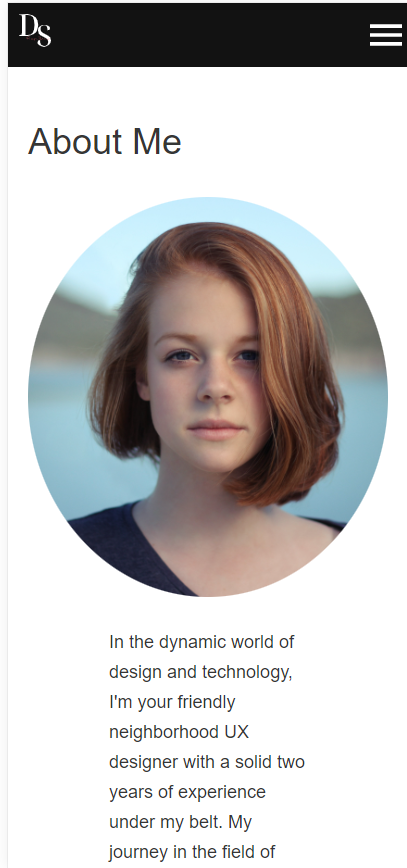
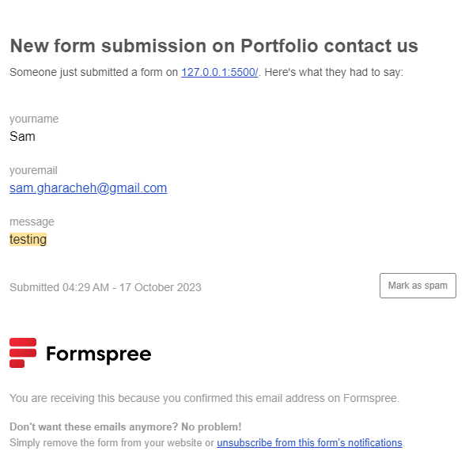
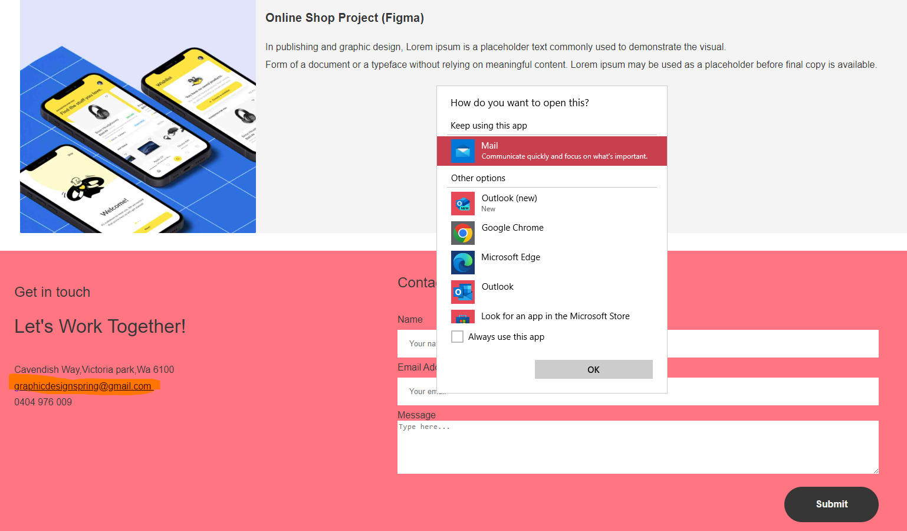
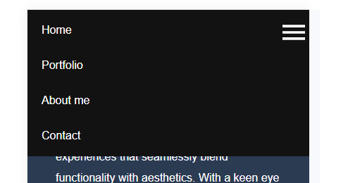
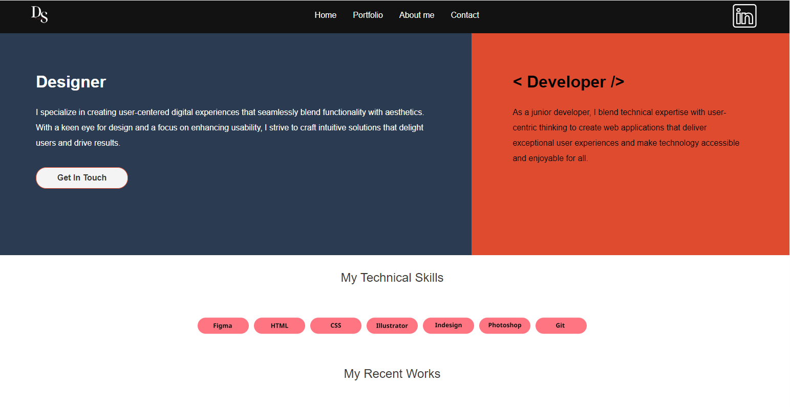
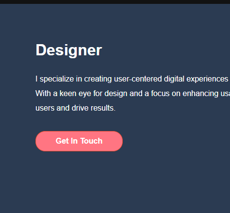
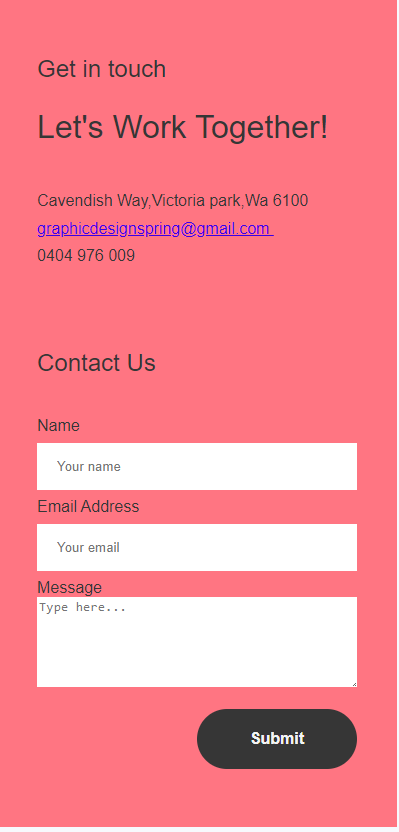
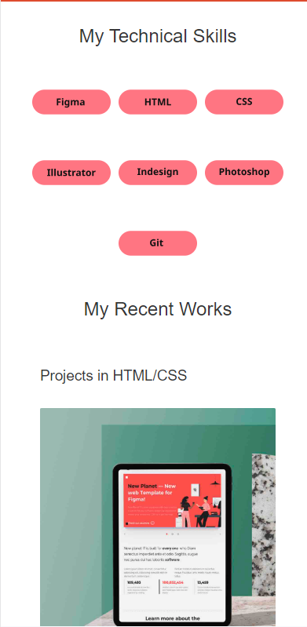
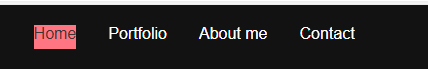
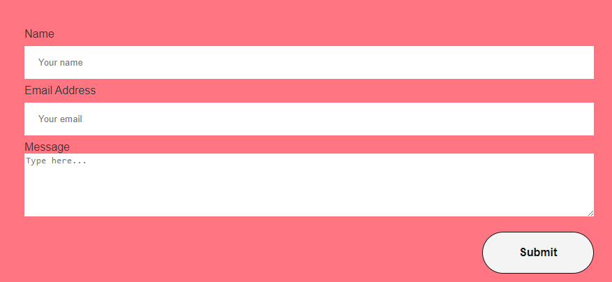

# Sahar Kavousi - Portfolio Task

[My portfolio site](https://sahar-kavousi.github.io/)

## Project Requirements

### Content

{{ For a user profile to be effective on a platform or website, it should include essential components for an engaging and informative experience. Primarily, it should present a unique profile picture, offering a visual representation of the user. Biography, offers a glimpse into the user's background and interests. A functional contact form allows easy communication, fostering networking and collaboration. Inclusion of a "Projects" section highlights the our professional or personal endeavors, showcasing their skills and accomplishments. Moreover, links to external sites, such as GitHub and LinkedIn, serve as valuable gateways to explore the user's portfolio and professional connections, enhancing the overall profile's credibility and depth. }}

- [x] At least one profile picture
- [x] Biography (at least 100 words)
- [x] Functional Contact Form
- [x] "Projects" section
- [x] Links to external sites, e.g. GitHub and LinkedIn.

### Technical

{{ A well-crafted website embodies several vital attributes. It comprises a minimum of two web pages, ensuring that content is organized and easily navigable.
To maintain code integrity and facilitate collaborative development, it is version controlled with Git.
Deployed on GitHub Pages, the website is accessible to a global audience.
It adheres to responsive design principles, adapting gracefully to various screen sizes for a seamless user experience. Additionally, it employs semantic HTML, enhancing accessibility and search engine optimization by using meaningful tags and structures. }}

- [x] At least 2 web pages.
- [x] Version controlled with Git
- [x] Deployed on GitHub pages.
- [x] Implements responsive design principles.
- [x] Uses semantic HTML.

### Bonus (optional)

{{ Elevating the website's user experience, it incorporates various dynamic elements and interaction enhancements. Distinguishing itself with different styles for active, hover, and focus states, the site becomes more engaging and intuitive. JavaScript is skillfully integrated to introduce dynamic features, adding that extra touch of interactivity, which can range from interactive forms to animated elements, elevating the overall user engagement and making the website stand out as extra tricky and impressive. }}

- [x] Different styles for active, hover and focus states.
- [x] Include JavaScript to add some dynamic elements to your site. (Extra
      tricky!)

### Screenshots

> Please include the following:
>
> - The different pages and features of your website on mobile, tablet and
>   desktop screen sizes (multiple screenshots per page and screen size).
> - The different features of your site, e.g. if you have hover states, take a
>   screenshot that shows that.
>
> You can do this by saving the images in a folder in your repo, and including
> them in your readme document with the following Markdown code:

#### {{ Sahar portfolio screenshots}}

#### {{ Sahar portfolio screenshots}}

#### {{ Sahar portfolio screenshots}}

#### {{ Sahar portfolio screenshots}}

#### {{ Sahar portfolio screenshots}}

#### {{ Sahar portfolio screenshots}}

#### {{ Sahar portfolio screenshots}}

#### {{ Sahar portfolio screenshots}}

#### {{ Sahar portfolio screenshots}}

#### {{ Sahar portfolio screenshots}}

#### {{ Sahar portfolio screenshots}}

#### {{ Sahar portfolio screenshots}}

